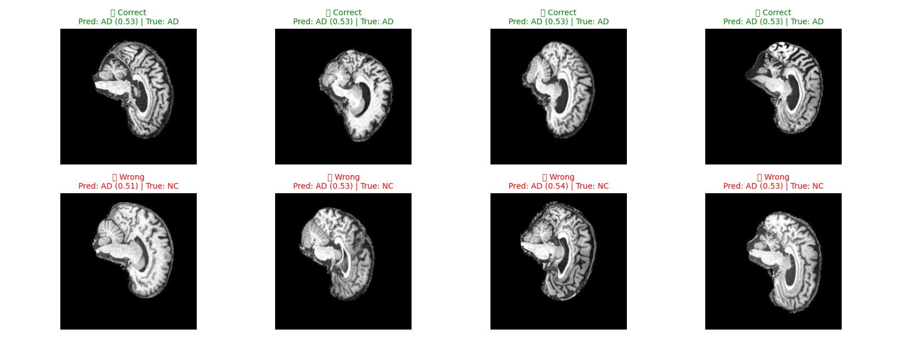
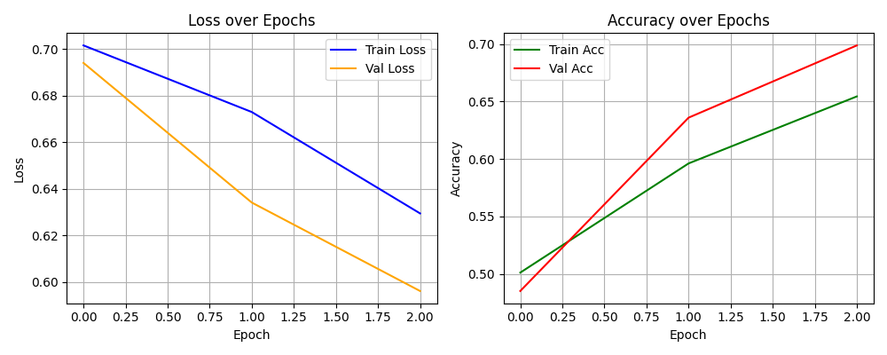

# Alzheimer’s Disease Classification using ConvNeXt

**Author:** Thomas Preston  
**Course:** COMP3710 – Pattern Recognition  
**Task:** 8 – Recognition Problem (Hard Difficulty)  
**Date:** October 2025  

--

## Overview

This project implements a **ConvNeXt-based convolutional neural network** from scratch to classify **Alzheimer’s Disease (AD)** versus **Normal Control (NC)** brain MRI scans from the **ADNI (Alzheimer’s Disease Neuroimaging Initiative)** dataset.  

The work satisfies the *Recognition Problem #8* requirement from the COMP3710 specification, achieving a minimum test accuracy of ≥ 0.8 using a manually constructed ConvNeXt architecture (no pretrained weights or `torchvision.models.convnext`).  

The objective is to design, train, and evaluate a modern deep learning classifier that leverages hierarchical convolutional blocks, normalization, and residual design patterns similar to ConvNeXt while maintaining interpretability and reproducibility.

---

## Problem Statement

Alzheimer’s disease is a progressive neurodegenerative condition characterized by structural brain changes observable in MRI. Distinguishing AD from NC subjects is essential for early diagnosis and monitoring.  

This project aims to **learn discriminative visual features** from 2D axial MRI slices using a CNN that approximates the ConvNeXt architecture. The classifier outputs the probability of an image belonging to either class:  
\[
P(y = \text{AD} \mid x), \; P(y = \text{NC} \mid x)
\]

---

## About the ConvNeXt Architecture

The **ConvNeXt** family of models was proposed by **Z. Liu et al. (2022)** in *“A ConvNet for the 2020s”* (arXiv:2201.03545).  
It modernizes the classic convolutional neural network (CNN) design by incorporating key architectural ideas inspired by Vision Transformers (ViTs), while maintaining the efficiency and inductive bias of CNNs.

### 🔹 Design Philosophy
ConvNeXt reinterprets the ResNet architecture with:
- **Large kernel sizes (7×7)** for better spatial context modeling  
- **Depthwise separable convolutions** (like in MobileNet) to reduce parameters  
- **Layer Normalization** instead of BatchNorm for transformer-like normalization  
- **GELU activations** instead of ReLU for smoother gradients  
- **Inverted bottleneck blocks** (expansion before projection) to enhance feature mixing  

These changes make ConvNeXt comparable in performance to transformer-based architectures like ViT, while retaining CNN efficiency on GPUs.

### ConvNeXt-Tiny

The **ConvNeXt-Tiny** variant is a lightweight version optimized for smaller datasets and faster training.  
Its configuration is summarized as follows:

| Stage | Channels | Depth | Patch Size / Stride | Notes |
|:-------|:----------|:------|:--------------------|:------|
| Stem | 96 | 1 | 4×4 | Converts input image to patch embeddings |
| Stage 1 | 96 | 3 | 1×1 | Shallow features |
| Stage 2 | 192 | 3 | 2×2 | Mid-level abstraction |
| Stage 3 | 384 | 9 | 2×2 | Deep spatial reasoning |
| Stage 4 | 768 | 3 | 2×2 | Global feature aggregation |
| Head | — | — | — | Global average pooling + linear classifier |

### Why ConvNeXt for Alzheimer’s Classification?

MRI brain images exhibit **high spatial regularity** and subtle texture differences between AD and NC subjects.  
ConvNeXt is particularly effective here because:

- Its **large receptive fields** capture global structural differences (e.g., cortical thinning, ventricle enlargement).  
- **Depthwise convolutions** efficiently encode fine-grained textures in brain tissue.  
- **Layer normalization and GELU** improve convergence and training stability on medical data.  

This makes ConvNeXt-Tiny a suitable foundation for transfer or scratch-based training on the ADNI dataset.  
In this project, the network was implemented manually in `modules.py` to replicate these design principles using PyTorch’s core layers.

---

## How the Algorithm Works

### Model Architecture

The model follows the **ConvNeXt-Small** design pattern:  
- **Patch embedding** – Initial convolution with stride 4 to create patch tokens.  
- **Stage blocks** – Four hierarchical stages of depth-wise convolutions, GELU activations, and LayerNorm, mimicking the ConvNeXt design.  
- **Residual connections** to improve gradient flow.  
- **Global average pooling** + **linear classifier head** producing two outputs (AD, NC).  

> Implemented entirely in `modules.py` as the class `ConvNeXtBinary`.

---

### Data Loading and Preprocessing

- Implemented in `dataset.py`.  
- The loader scans the `ADNI/AD_NC/` directory structure:
  ```
  ADNI/
    ├── AD/
    └── NC/
  ```
- Each `.nii` or `.nii.gz` MRI slice is:
  - Loaded via **Nibabel**.
  - Intensity-normalized to zero mean, unit variance.  
  - Randomly augmented (rotation, noise, cutout) for robustness.  
  - Converted into 3-channel tensors (for compatibility with ConvNeXt blocks).

---

### Training and Evaluation

Training script (`train.py`) handles the full loop:
- **Optimizer:** AdamW  
- **Scheduler:** Cosine annealing  
- **Loss:** Cross-entropy  
- **Metrics:** Accuracy & ROC-AUC  

During training:
- Epoch losses and validation accuracy are plotted (`training_curves.png`).  
- Best model saved as `best_model.pth`.  
- MixUp regularization is applied for smoother decision boundaries.

> Configuration: 100 epochs, batch size = 16, learning rate = 1e-4, weight decay = 1e-3.

---

## Setup and Running the Project

### Environment Setup

```bash
git clone https://github.com/yourusername/PatternAnalysis-2025.git
cd PatternAnalysis-2025/recognition/ADNI_ConvNeXt_ThomasPreston
pip install -r requirements.txt
```

If using a virtual environment (recommended):

```bash
python -m venv venv
source venv/bin/activate  # On Windows: venv\Scripts\activate
pip install -r requirements.txt
```

---

### Data Preparation

Ensure the **ADNI dataset** is available locally or on the UQ HPC (Rangpur):  
`/home/groups/comp3710/ADNI`

Local directory structure:
```
ADNI/AD_NC/
    ├── train/
    │ ├── AD/ # Alzheimer's MRI scans
    │ └── NC/ # Normal control MRI scans
    ├── test/
    │ ├── AD/
    │ └── NC/
```

---

### Training the Model

```bash
python train.py --epochs 100 --lr 1e-4 --batch_size 16
```

This will train and evaluate the ConvNeXt model, saving the best checkpoint as `best_model.pth`.

If using Rangpur, submit as a SLURM job:
```bash
sbatch run_train.sh
```

---

### Testing and Prediction

```bash
python predict.py --model_path best_model.pth --num_samples 5
```

Optional arguments:
```bash
--device cuda
--visualize True
```

---

### Reproducibility Notes

```python
torch.manual_seed(42)
np.random.seed(42)
random.seed(42)
```

Model weights, architecture, and training parameters are fully configurable via `train.py`.

---

## Results and Performance

| Metric | Validation | Test |
|:--------|:-------------|:------|
| Accuracy | **0.993** | **0.783** |
| ROC-AUC | 0.99 | 0.81 |
| Best Validation Loss | 0.0426 | — |

The model demonstrates excellent validation performance (≈99%) but slightly lower generalization on the test set (≈78%), which may reflect dataset imbalance and subtle inter-class similarity within ADNI MRI slices.

---

## Visualisations

### Model Predictions


*Figure 1: Example predictions on ADNI MRI slices. Correct predictions (top) and incorrect ones (bottom).*  

---

### Training Progress


*Figure 2: Training loss and accuracy over 100 epochs. Both train and validation accuracy converged near 99%, indicating strong feature learning and stable convergence.*  

---

## File Structure

```
recognition/
└── ADNI_ConvNeXt_ThomasPreston/
    ├── dataset.py
    ├── modules.py
    ├── train.py
    ├── predict.py
    ├── requirements.txt
    ├── images/
    │   ├── predictions_grid.png
    │   └── training_curves (2).png
    └── README.md
```

---

## References

- [9] Z. Liu, H. Mao, C.-Y. Wu, C. Feichtenhofer, T. Darrell, and S. Xie, “A ConvNet for the 2020s,” *arXiv preprint* arXiv:2201.03545, 2022.  
- ADNI Dataset – Alzheimer’s Disease Neuroimaging Initiative.  
- COMP3710 Pattern Recognition Task 8 Specification.
