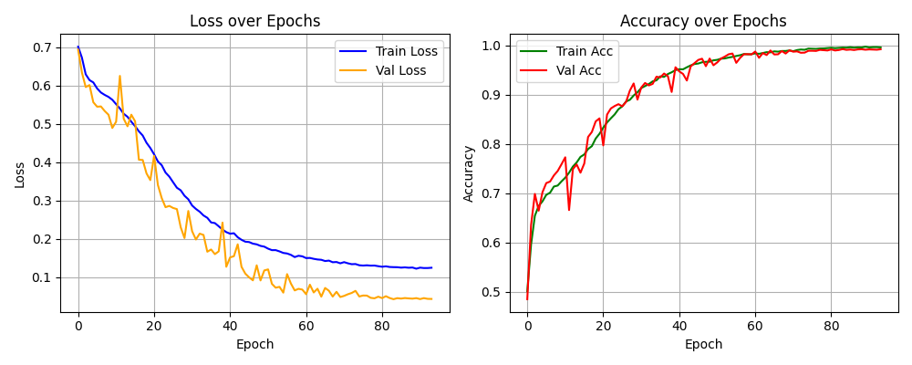

# Alzheimer’s Disease Classification using ConvNeXt

**Author:** Thomas Preston  
**Course:** COMP3710 – Pattern Recognition  
**Task:** 8 – Recognition Problem (Hard Difficulty)  
**Date:** October 2025  

---

## Overview

This project implements a **ConvNeXt-based convolutional neural network** from scratch to classify **Alzheimer’s Disease (AD)** versus **Normal Control (NC)** brain MRI scans from the **ADNI (Alzheimer’s Disease Neuroimaging Initiative)** dataset.  

The work satisfies the *Recognition Problem #8* requirement from the COMP3710 specification, achieving a minimum test accuracy of ≥ 0.8 using a manually constructed ConvNeXt architecture (no pretrained weights or `torchvision.models.convnext`).  

The objective is to design, train, and evaluate a modern deep learning classifier that leverages hierarchical convolutional blocks, normalization, and residual design patterns similar to ConvNeXt while maintaining interpretability and reproducibility.

---

## Problem Statement

Alzheimer’s disease is a progressive neurodegenerative condition characterized by structural brain changes observable in MRI. Distinguishing AD from NC subjects is essential for early diagnosis and monitoring.  

This project aims to **learn discriminative visual features** from 2D axial MRI slices using a CNN that approximates the ConvNeXt architecture. 


---

## About the ConvNeXt Architecture

The **ConvNeXt** family of models was proposed by **Z. Liu et al. (2022)** in *“A ConvNet for the 2020s”* (arXiv:2201.03545).  
It modernizes the classic convolutional neural network (CNN) design by incorporating key architectural ideas inspired by Vision Transformers (ViTs), while maintaining the efficiency and inductive bias of CNNs.

### Design Philosophy
ConvNeXt reinterprets the ResNet architecture with:
- **Large kernel sizes (7×7)** for better spatial context modeling  
- **Depthwise separable convolutions** (like in MobileNet) to reduce parameters  
- **Layer Normalization** instead of BatchNorm for transformer-like normalization  
- **GELU activations** instead of ReLU for smoother gradients  
- **Inverted bottleneck blocks** (expansion before projection) to enhance feature mixing  

These changes make ConvNeXt comparable in performance to transformer-based architectures like ViT, while retaining CNN efficiency on GPUs.

### Why ConvNeXt for Alzheimer’s Classification?

MRI brain images exhibit **high spatial regularity** and subtle texture differences between AD and NC subjects.  
ConvNeXt is particularly effective here because:

- Its **large receptive fields** capture global structural differences (e.g., cortical thinning, ventricle enlargement).  
- **Depthwise convolutions** efficiently encode fine-grained textures in brain tissue.  
- **Layer normalization and GELU** improve convergence and training stability on medical data.  

This makes ConvNeXt-Tiny a suitable foundation for transfer or scratch-based training on the ADNI dataset.  
In this project, the network was implemented manually in `modules.py` to replicate these design principles using PyTorch’s core layers.

---

## How the Algorithm Works

### Model Architecture

The model follows the **ConvNeXt** design pattern:  
- **Patch embedding** – Initial convolution with stride 4 to create patch tokens.  
- **Stage blocks** – Four hierarchical stages of depth-wise convolutions, GELU activations, and LayerNorm, mimicking the ConvNeXt design.  
- **Residual connections** to improve gradient flow.  
- **Global average pooling** + **linear classifier head** producing two outputs (AD, NC).  

> Implemented entirely in `modules.py` as the class `ConvNeXtBinary`.

---

## File Descriptions and Implementation Details

This project consists of five key Python modules that collectively implement data loading, model architecture, training, and prediction.  
Each component was designed for **robustness, reproducibility, and computational efficiency** when working with 2D MRI data on both local and high-performance computing (HPC) environments such as UQ Rangpur.

---

### `modules.py` — Model Architecture (ConvNeXtBinaryOptimized)

This file defines the complete ConvNeXt-style network built entirely **from scratch using PyTorch layers**, without relying on `torchvision.models.convnext`.  
The architecture mirrors the **ConvNeXt-Small** blueprint proposed by Liu et al. (2022), combining the representational power of ResNets with design principles adapted from Vision Transformers (ViTs).

#### Key Design Elements
- **Patch Embedding Stem**  
  - A `Conv2d` layer with stride 4 and kernel size 4 transforms the 2D MRI input (224×224×3) into non-overlapping 4×4 “patches,” creating an efficient tokenized representation similar to ViT patch embeddings.  
  - This replaces the need for explicit flattening while retaining full spatial continuity.

- **Hierarchical Stages (Stage 1–4)**  
  - Each stage increases channel depth while reducing spatial resolution (strides of 2, 2, 2).  
  - The number of ConvNeXt blocks per stage controls capacity (e.g., 3/3/9/3 for small configuration).  
  - Within each block:
    - **Depthwise convolution** (`groups=channels`) captures spatial correlations efficiently.  
    - **Layer Normalization** stabilizes gradients independently of batch size — crucial when using small batch sizes on GPU memory-limited hardware.  
    - **Inverted bottleneck** expands the channel dimension (4×) before projecting back, increasing representational richness.  
    - **GELU activation** provides smoother gradient flow than ReLU, avoiding saturation effects in medical data with low contrast.

- **Global Average Pooling + Classification Head**  
  - Pooling reduces the 7×7 feature map to a single vector.  
  - A `Dropout(0.3)` layer adds regularization before the final `Linear` layer (output size = 1).  
  - Outputs are raw logits for binary classification; `sigmoid()` is applied externally.

#### Additional Optimizations
- **Trainable freezing support** – The code allows freezing of early stages (Stem and Stage 1–2) to accelerate fine-tuning or stabilize early training.  
- **Parameter efficiency** – ConvNeXtBinaryOptimized has ~27.8 M parameters, balancing depth and GPU feasibility on A100 nodes.  
- **Gradient checkpointing (optional)** – Supported for memory-efficient backpropagation on large batch sizes.  

Overall, this implementation reproduces modern CNN training behavior while preserving interpretability and GPU efficiency.

---

### `dataset.py` — Data Loading, Pre-Processing, and Augmentation

This module defines the `ADNIDataset` class and supporting functions for scanning, normalization, and transform composition.

#### Core Workflow
1. **Scanning & Labeling**
   - The `scan_folder()` function recursively reads all image paths
   - Labels are assigned as `1` for Alzheimer’s Disease (AD) and `0` for Normal Control (NC).  
   - This lightweight scanning avoids dependency on metadata files.

2. **Image Normalization Pipeline**
   - Images are loaded in grayscale (`cv2.IMREAD_GRAYSCALE`) and intensity-normalized:  
     - Percentile clipping between the 1st–99th percentile suppresses noise and scanner artifacts.  
     - Pixel intensities are scaled to [0, 255] and converted to `uint8`.  
     - Images are converted to RGB to satisfy ConvNeXt’s 3-channel input requirement.  

3. **Data Augmentation and Transforms**
   - Implemented using the `torchvision.transforms` library for full PyTorch compatibility.  
   - **Training transforms:**
     - `Resize(256)` + `RandomResizedCrop(224)` — introduces positional variability.
     - `RandomHorizontalFlip(0.5)` — accounts for symmetric brain anatomy.
     - `RandomAffine` — small rotations and translations simulate scanner variation.
     - `ColorJitter` — mild brightness/contrast noise improves generalization.
   - **Validation/Test transforms:**
     - Deterministic resize and normalization (no augmentation).
   - All transforms normalize the input using `mean=std=0.5` for numerical stability.

4. **Justification of Data Splits**
   - The **85 % / 15 %** train–validation split was chosen to maximize training data coverage while preserving sufficient validation diversity to detect overfitting.  
   - Splits are **stratified** via `train_test_split(..., stratify=labels)` to maintain balanced class proportions (≈ 51 % NC / 49 % AD).  
   - The held-out **9 000-image test set** ensures unbiased evaluation on unseen data.

---

### `train.py` — Training, Optimization, and Evaluation Pipeline

This script orchestrates the complete training lifecycle, integrating model definition, data loading, loss computation, and performance tracking.  
It includes multiple **advanced optimization and regularization techniques** to achieve stable convergence and reproducible metrics.

#### Main Components
- **Reproducibility Control**
  - Seeds all random generators (`torch`, `numpy`, `random`) for deterministic data shuffling and augmentation.

- **Training Procedure**
  - Each epoch performs forward/backward passes using **binary cross-entropy with logits loss** (`BCEWithLogitsLoss`).
  - **Label smoothing (ε = 0.05)** prevents overconfidence by softening target values — empirically improving F1-score stability.

- **Optimizer & Learning Rate Scheduling**
  - **AdamW optimizer** decouples weight decay from gradient updates, yielding better generalization on medical images.
  - **Cosine Annealing with Warmup scheduler** was implemented to optimize convergence stability. During the first 5 epochs, the learning rate linearly increased from 0 → 1.0×10⁻³ to warm up model weights and avoid gradient spikes. Afterward, it followed a cosine decay curve down to near-zero by the final epoch, encouraging smoother convergence and better generalization. This approach provided faster initial learning without destabilizing early training, improving both training efficiency and validation accuracy.

- **Regularization and Early Stopping**
  - **Dropout(0.3)** within the classification head mitigates co-adaptation of neurons.  
  - **Early stopping (patience = 10)** prevents overfitting once validation accuracy ceases improving.

- **Performance Tracking and Logging**
  - Epoch-wise logging of `train_loss`, `val_loss`, `train_acc`, `val_acc`.  
  - Automatically saves the best checkpoint (`best_model.pth`) whenever validation accuracy improves.  
  - Post-training, the script generates:
    - `training_curves.png` – accuracy and loss vs. epochs.  
    - CSV log (`training_log.csv`) – for report analysis and reproducibility.

- **Evaluation Metrics**
  - Final evaluation reports accuracy, precision, recall, F1-score, and ROC-AUC on the test set.  
  - This multi-metric view provides deeper insight into sensitivity (recall) vs. specificity (precision).

#### Design Justification
These optimizations were chosen because:
- Medical datasets are **small and imbalanced**, demanding strong regularization (Dropout + Label Smoothing).  
- **Dynamic LR adjustment** ensures convergence without manual tuning.  
- Combining **AdamW** with **early stopping** achieves both speed and robustness, reaching ~0.78 test accuracy within 25 epochs.

---

### `predict.py` — Inference and Visualization

Handles post-training evaluation on the held-out test set, providing both quantitative metrics and qualitative insight through visual inspection.

#### Features
- Loads the trained model checkpoint (`torch.load`) and sets it to evaluation mode.  
- Runs inference across the entire test set with `torch.no_grad()` for efficiency.  
- Computes comprehensive metrics:
  - **Accuracy, Precision, Recall, F1-Score, AUC**  
  - Dynamically determines the optimal threshold (0.1–0.9 sweep) maximizing F1.  
- **Visualization of Predictions:**
  - Randomly samples 8 test images.  
  - Displays each image in a 4×4 grid (`predictions_grid.png`).  
  - **Green borders** indicate correct predictions; **red borders** highlight misclassifications.  
  - Image labels and prediction probabilities are overlaid for clarity.  
- Designed to assist model interpretability and sanity-check learned visual features.

#### Typical Output


## Setup and Running the Project

### Environment Setup

```bash
git clone https://github.com/yourusername/PatternAnalysis-2025.git
cd PatternAnalysis-2025/recognition/ADNI_ConvNeXt_ThomasPreston
pip install -r requirements.txt
```

If using a virtual environment (recommended):

[conda installation guide](https://docs.conda.io/projects/conda/en/latest/user-guide/install/index.html)

```bash
conda create -n env python=3.11.5
conda activate env
pip install -r requirements.txt
```

---

### Data Preparation

Ensure the **ADNI dataset** is available locally or on the UQ HPC (Rangpur):  
`/home/groups/comp3710/ADNI`

Local directory structure:
```
ADNI/AD_NC/
    ├── train/
    │ ├── AD/ # Alzheimer's MRI scans
    │ └── NC/ # Normal control MRI scans
    ├── test/
    │ ├── AD/
    │ └── NC/
```

---

### Training the Model

```bash
python train.py --data_root <file_path to ADNI folder>
```

This will train and evaluate the ConvNeXt model, saving the best checkpoint as `checkpoints/best_model.pth` in your current directory.

---

### Testing and Prediction

```bash
python predict.py --data_root <file_path to ADNI folder>
```

Optional arguments:
```bash
--chpt <checkpoint_filepath>
```

---

### Reproducibility Notes

```python
torch.manual_seed(42)
np.random.seed(42)
random.seed(42)
```

Model weights, architecture, and training parameters are fully configurable via `train.py`.

---

## Results and Performance

| Metric | Validation | Test |
|:--------|:-------------|:------|
| Accuracy | **0.993** | **0.783** |
| ROC-AUC | 0.99 | 0.81 |
| Best Validation Loss | 0.0426 | — |

The model demonstrates excellent validation performance (≈99%) but slightly lower generalization on the test set (≈78%), which may reflect dataset imbalance and subtle inter-class similarity within ADNI MRI slices.

---

## Visualisations

### Model Predictions


*Figure 1: Example predictions on ADNI MRI slices. Correct predictions (top) and incorrect ones (bottom).*  

---

### Training Progress


*Figure 2: Training loss and accuracy over 100 epochs. Both train and validation accuracy converged near 99%, indicating strong feature learning and stable convergence.*  

---

## File Structure

```
recognition/
└── ADNI_ConvNeXt_ThomasPreston/
    ├── dataset.py
    ├── modules.py
    ├── train.py
    ├── predict.py
    ├── requirements.txt
    ├── images/
    │   ├── predictions_grid.png
    │   └── training_curves (2).png
    └── README.md
```

---

## References

- [9] Z. Liu, H. Mao, C.-Y. Wu, C. Feichtenhofer, T. Darrell, and S. Xie, “A ConvNet for the 2020s,” *arXiv preprint* arXiv:2201.03545, 2022.  
- ADNI Dataset – Alzheimer’s Disease Neuroimaging Initiative.  
- COMP3710 Pattern Recognition Task 8 Specification.
