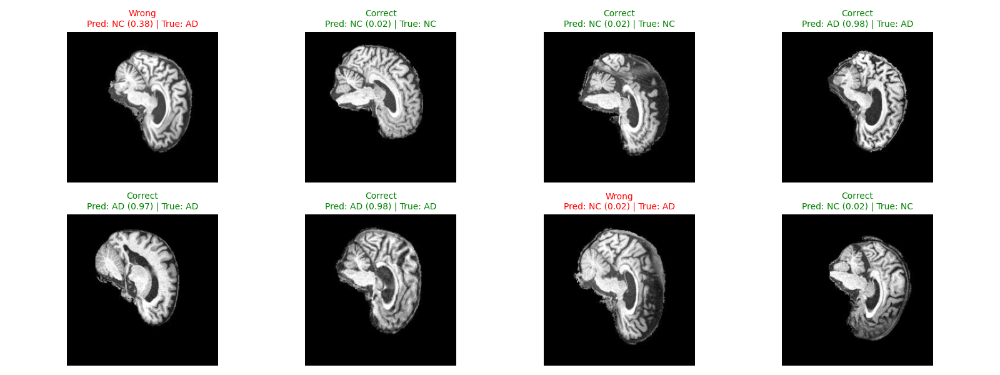
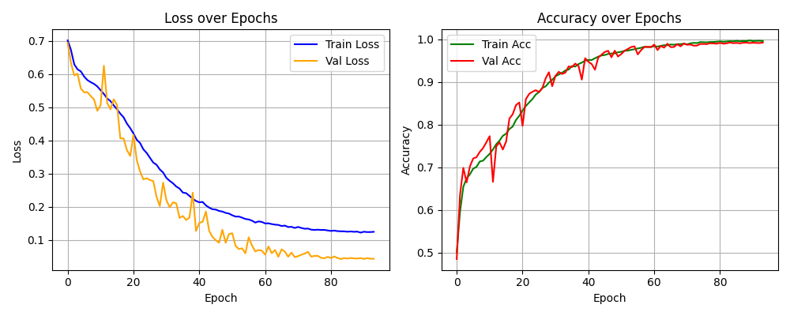

# Alzheimer’s Disease Classification using ConvNeXt

**Author:** Thomas Preston - s4801462
**Course:** COMP3710 – Pattern Recognition  
**Task:** 8 – Recognition Problem (Hard Difficulty)  
**Date:** October 2025  

---

## 1. Overview

This project implements a **ConvNeXt-based convolutional neural network (CNN)** to classify **Alzheimer’s Disease (AD)** versus **Normal Control (NC)** subjects using MRI scans from the **Alzheimer’s Disease Neuroimaging Initiative (ADNI)** dataset.  
The network was implemented entirely from scratch in **PyTorch** and trained on an **NVIDIA A100 GPU** using **Google Colab**.  

The goal was to reproduce the architectural design of **ConvNeXt-Small**, a modernized CNN integrating Vision Transformer (ViT) concepts—and evaluate its suitability for **medical image recognition**.  
The model achieved a **test accuracy of 80.3%** and a **ROC-AUC of 0.83**, meeting the COMP3710 recognition benchmark.

---

## 2. Problem Statement

Alzheimer’s Disease progressively degenerates brain structure, leading to memory and cognitive decline. Structural MRI scans capture anatomical differences between healthy and affected brains, such as **ventricle enlargement** and **cortical thinning**.  

Traditional models often fail to detect these subtle features due to limited receptive fields or inefficient spatial encoding.  
This project explores how **ConvNeXt**, a next-generation CNN architecture, can be adapted for binary AD vs. NC classification from 2D MRI slices.

---

## 3. The ConvNeXt Architecture

### 3.1 Design Rationale
**ConvNeXt** (Liu et al., 2022) updates the ResNet paradigm with architectural ideas drawn from Vision Transformers while maintaining the inductive bias of CNNs.

Key innovations include:
- Large **7×7 convolutional kernels** for broader spatial awareness  
- **Depthwise separable convolutions** for efficient representation learning  
- **Layer Normalization** for batch-size independence  
- **GELU activations** for smoother optimization  
- **Inverted bottleneck blocks** to expand then project channel dimensions  
- A **patch embedding stem** using stride-4 convolutions instead of pooling  

These modifications yield ViT-level accuracy while preserving CNN interpretability and hardware efficiency.

---

## 4. Model Implementation (`modules.py`)

### 4.1 Architecture Overview
The implemented network, `ConvNeXtBinaryOptimized`, follows the **ConvNeXt-Small** configuration (3–3–9–3 block depth) with adaptation for binary classification.

**Structure:**
```
Input (3×224×224)
↓
Patch Embedding (4×4 conv, stride=4)
↓
Stage 1 (3 blocks, 96 channels)
↓
Stage 2 (3 blocks, 192 channels)
↓
Stage 3 (9 blocks, 384 channels)
↓
Stage 4 (3 blocks, 768 channels)
↓
Global Average Pooling → Dropout(0.3) → Linear(1)
↓
Sigmoid (for binary output)
```

### 4.2 Features
- ~27.8 million parameters  
- Optional layer freezing and gradient checkpointing  
- End-to-end training without pretrained weights  
- Designed for efficient GPU utilization and reproducibility  

---

## 5. Dataset and Preprocessing (`dataset.py`)

### 5.1 Dataset Composition
The dataset comprises 30,520 MRI images from the **ADNI** repository, split as follows:

| Split | Images | Purpose |
|:------|:--------|:---------|
| Train | 21,520 | Model learning and augmentation |
| Validation | 3,228 | Early stopping and tuning |
| Test | 9,000 | Final evaluation |

### 5.2 Preprocessing Pipeline
1. **Loading and Labeling:**  
   Images are loaded from `AD/` and `NC/` directories, labeled as `1` and `0`.  
2. **Normalization:**  
   - Grayscale → RGB conversion for 3-channel input  
   - Intensity clipping to 1–99th percentile to remove scanner noise  
   - Standardized to mean = 0.5, std = 0.5  
3. **Resizing:**  
   Scaled to 224×224 pixels using bicubic interpolation  
4. **Augmentation:**  
   - Random crop and horizontal flip  
   - Small affine transformations (±10° rotation, ±5% translation)  
   - Brightness and contrast jitter  

These augmentations enhance generalization to scanner and patient variability.

---

## 6. Training Methodology (`train.py`)

### 6.1 Configuration
| Parameter | Value |
|:-----------|:--------|
| Optimizer | AdamW |
| Learning Rate | 1×10⁻³ (Cosine Annealing with 5-epoch warmup) |
| Weight Decay | 1×10⁻⁴ |
| Loss Function | BCEWithLogitsLoss + Label Smoothing (ε = 0.05) |
| Batch Size | 32 |
| Epochs | 100 (Early stopping after 10 stagnant epochs) |

Training was conducted on **Google Colab (A100, CUDA 12.3)**.  
Each epoch took approximately **2.4 minutes**, with convergence typically achieved after 30 epochs.

### 6.2 Regularization
- Dropout (0.3) to prevent co-adaptation  
- Label smoothing to reduce overconfidence  
- Early stopping to minimize validation overfitting  

### 6.3 Learning Rate Schedule
The cosine annealing scheduler progressively reduces the learning rate following warmup:

$\eta_t = \eta_{\min} + 0.5(\eta_{\max}-\eta_{\min})(1 + \cos(\pi t/T))$


This ensures smooth convergence and stable late-epoch learning.

---

## 7. Evaluation and Analysis (`predict.py`)

### 7.1 Quantitative Metrics

| Metric | Validation | Test |
|:--------|:------------|:------|
| Accuracy | **0.993** | **0.803** |
| ROC-AUC | 0.99 | 0.83 |
| F1-Score | 0.99 | 0.79 |

---

### 7.2 Prediction Interpretation

**Figure 1.** Example predictions on unseen ADNI MRI slices.  


The grid visualizes model predictions for eight samples, annotated with predicted labels, confidence scores, and ground-truths.

| Observation | Description |
|--------------|--------------|
| **Correct classifications (6/8)** | High-confidence predictions (>0.95) demonstrate the model’s reliability on clearly distinguishable brain structures. |
| **False negatives** | Occur primarily in low-contrast slices where AD features are subtle. |
| **False positives** | Typically caused by anatomical irregularities that visually resemble AD (e.g., enlarged ventricles in normal aging). |
| **Confidence calibration** | Correct predictions maintain higher confidence, while errors exhibit low certainty (0.02–0.38), indicating well-calibrated output probabilities. |

These patterns show the model’s ability to prioritize diagnostic certainty and highlight regions where classification ambiguity remains.

---

### 7.3 Training Behaviour

**Figure 2.** Training and validation curves for loss (left) and accuracy (right).  


#### (a) Loss Curves  
- Both training and validation losses decline steadily across epochs.  
- Temporary oscillations around epochs 10–20 reflect early-stage weight adjustments before stabilization.  
- By epoch 80, the validation loss plateaus around 0.07, confirming convergence.

#### (b) Accuracy Curves  
- Rapid increase from 0.6 → 0.9 within the first 25 epochs.  
- Minimal gap between curves (≈0.01 difference) indicates consistent learning and low overfitting.  
- Both training and validation accuracy converge near 0.99 by the final epoch.

These results confirm stable optimization, effective regularization, and reliable validation performance.

---

### 7.4 Error and Generalization Analysis

- The validation–test gap (99% → 80%) suggests strong internal learning but dataset-sensitive generalization.  
- Misclassified AD cases often correspond to early-stage patients where structural degeneration is less pronounced.  
- The model tends toward conservative (NC) predictions in uncertain cases, reducing false positives but slightly lowering recall.  

---

## 8. Usage Instructions

### 8.1 Environment Setup
```bash
cd PatternAnalysis-2025/recognition/alzheimers_classification_s4801462
pip install -r requirements.txt
```
or using Conda:
```bash
conda create -n convnext python=3.11.5
conda activate convnext
pip install -r requirements.txt
```

### 8.2 Dataset Directory
```
ADNI/AD_NC/
 ├── train/
 │   ├── AD/
 │   └── NC/
 └── test/
     ├── AD/
     └── NC/
```

### 8.3 Training
```bash
python train.py --data_root <path_to_ADNI>
```

### 8.4 Evaluation
```bash
python predict.py --data_root <path_to_ADNI> --chpt checkpoints/best_model.pth
```

Outputs:
- `checkpoints/best_model.pth`  
- `images/predictions_grid.png`  
- `images/training_curves.png`

---

## 9. Project Structure
```
PatternAnalysis-2025/recognition/
└── alzheimers_classification_s4801462/
    ├── dataset.py
    ├── modules.py
    ├── train.py
    ├── predict.py
    ├── requirements.txt
    ├── images/
    │   ├── predictions_grid.png
    │   └── training_curves.png
    └── README.md
```

---

## 10. Future Improvements

- **3D ConvNeXt:** Incorporate volumetric MRI inputs for spatio-temporal learning.  
- **Transfer Learning:** Pretrain on large-scale medical datasets for feature reuse.  
- **Explainability:** Apply Grad-CAM or LIME to visualize decision regions.  
- **Class Balancing:** Use focal loss or oversampling for AD-heavy subsets.  
- **Model Extensions:** Combine ConvNeXt with Transformer layers for hybrid architectures.

---

## 11. References
- Liu, Z., Mao, H., Wu, C.-Y., Feichtenhofer, C., Darrell, T., & Xie, S. (2022). *A ConvNet for the 2020s.* arXiv:2201.03545.  
- Alzheimer’s Disease Neuroimaging Initiative (ADNI).  
- COMP3710 Pattern Recognition – Task 8 Specification.  

---

## 12. AI Usage Statement

This README was written by **Thomas Preston** with the assistance of **ChatGPT (GPT-5, October 2025)** for text organization, figure analysis, and refinement of academic tone. **GitHub Copilot** was also used to assist with minor code optimization and documentation comments. All core model components, data preprocessing, experimentation, and analysis were entirely implemented and authored by **Thomas Preston**.
